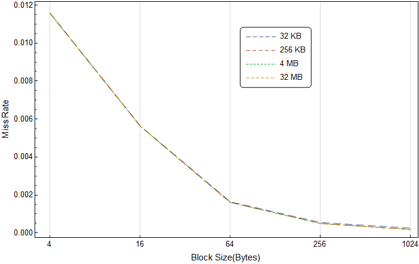
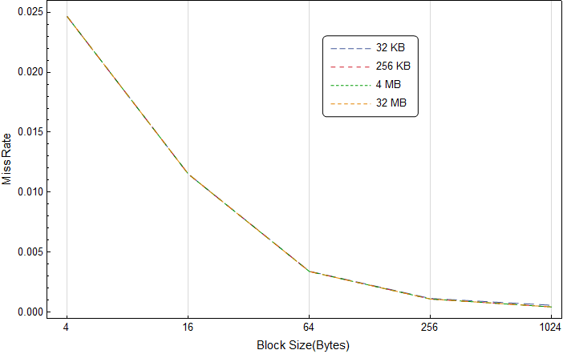
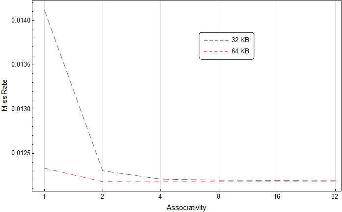
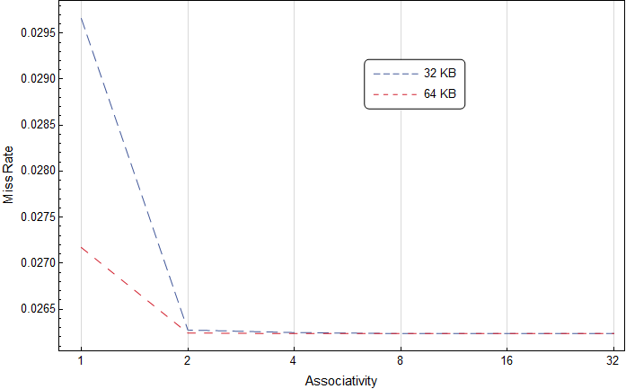

# Cache模拟器

## Part 1

### 一、编译与运行

本模拟器开发环境为`Ubuntu 18.04.1 LTS`，使用的编程语言为C++，编译器为`g++`。模拟器源码共包括7个文件：`def.h、storage.h、cache.h、cache.cc、memory.h、memory.cc、main.cc`，都放在`Cache_Simulator`文件夹中，在该文件夹中还有一个Makefile，如需编译模拟器，在终端输入`make`即可获得可执行程序`cache_simulator`。

该模拟器在命令行上的执行方式是

```c
./cache_simulator -I input_file_path [-CS CacheSize] [-BS BlockSize] [-A Associativity] 
    [-WT IsWriteThrough] [-WA IsWriteAllocate] [-CHL CacheHitLatency] [-CBL CacheBusLatency] 
    [-MHL MemoryHit Latency] [-MBL MemoryBusLatency]
Parameters: 
        [-I] 下一个参数为输入文件路径，不可省略，输入文件应为trace文件
        [-CS] 下一个参数为Cache大小取log(例如默认32KB即2^15B应设为15)
        [-BS] 下一个参数为Block大小取log(例如默认64B应设为6)
        [-A] 下一个参数为组相联度取log(例如默认8-way应设为3)
        [-WT] 下一个参数1为Write Through，0为Write Back(默认)
        [-WA] 下一个参数1为Write Allocate(默认)，0为No Write Allocate
        [-CHL] 下一个参数为Cache Hit Latency(默认为10)
        [-CBL] 下一个参数为Cache Bus Latency(默认为3)
        [-MHL] 下一个参数为Memory Hit Latency(默认为100)
        [-MBL] 下一个参数为Memory Bus Latency(默认为6)
```

使用`Cache_Simulator`文件夹中的`auto.sh`可以重现Part 1部分所有结果，结果记录在文件夹中的`result.txt`文件中。

### 二、实验结果及分析

#### 1.在不同的Cache Size(32KB~32MB)的条件下，Miss Rate随Block Size变化的趋势





其他条件：Associativity为8，写策略为Write Back+Write Allocate。

分析：从图中可以看出Miss Rate随着Block Size的增大逐渐减小，因为trace文件中的数据读写具有很强的局部性，所以增大Block Size可以使得一次Miss后将更多的相邻数据存入Cahe，使得之后Hit的几率大大增加，所以Miss Rate会随着Block Size的增加而减小。

#### 2.在给定Cache Size的条件下，Miss Rate随Associativity(1-32)变化的趋势





其他条件：Block Size为1B，写策略为Write Back+Write Allocate。

分析：可以看出，Miss Rate随着Block Size的增大逐渐减小(图中看不太明显，数据显示为减小)。原因是因为组相联度的增加，使得同一个Block可以被映射到的位置更多，所以更不容易发生替换，从而防止了频繁的换入换出，进而降低了Miss Rate。但第一张图蓝色折线最后有稍许上翘，分析认为，当组相联度过大时，set的数量减少，大量的相邻数据被映射到同一个set，而trace文件数据局部性很强，使得某一段访存序列频繁的被映射到同一个set，使得换入换出增加，进而使得Miss Rate增加。

#### 3.比较Write Through+No-write Allocate，Write Back+Write allocate两种访存策略的总访问延时的差异

执行命令参数选项与输出结果如下：
```c
./cache_simulator -I ../trace2019/trace1.txt -CS 18 -A 3 -BS 6 -WT 1 -WA 0
Total L1 access counter:471061
Total L1 access cycle:30064473
Total L1 miss num:5438
Total L1 replace num:0
Total L1 miss rate:0.011544
Total Mem access counter:197394
Total Mem access cycle:20923764

./cache_simulator -I ../trace2019/trace1.txt -CS 18 -A 3 -BS 6 -WT 0 -WA 1
Total L1 access counter:471061
Total L1 access cycle:6268053
Total L1 miss num:758
Total L1 replace num:0
Total L1 miss rate:0.001609
Total Mem access counter:758
Total Mem access cycle:80348

./cache_simulator -I ../trace2019/trace2.txt -CS 18 -A 3 -BS 6 -WT 1 -WA 0
Total L1 access counter:177618
Total L1 access cycle:10213132
Total L1 miss num:3394
Total L1 replace num:0
Total L1 miss rate:0.019108
Total Mem access counter:65511
Total Mem access cycle:6944166

./cache_simulator -I ../trace2019/trace2.txt -CS 18 -A 3 -BS 6 -WT 0 -WA 1
Total L1 access counter:177618
Total L1 access cycle:2420114
Total L1 miss num:603
Total L1 replace num:0
Total L1 miss rate:0.003395
Total Mem access counter:603
Total Mem access cycle:63918
```

结果分析：可以看出Write Back+Write allocate访存策略比Write Through+No-write Allocate访存策略有更小的miss率，并且总访问延时更小。对于miss数量，因为Write allocate在写内存miss时就会将数据所在块load到cache中，所以对于trace文件中这种数据局部性较强的访存序列，会大大减少之后读写相同块数据的miss率。对于总访问延时，首先是因为miss数量的减少使得Write Back+Write allocate访存策略访问延时大大减少，还有就是Write Through对于每次写操作都会通写到内存，大量的写操作会使得大量时间耗费到内存写中，大大增加了总访问延时。

## Part 2

### 一、编译与运行

本模拟器开发环境为`Ubuntu 18.04.1 LTS`，使用的编程语言为C++，编译器为`g++`。模拟器源码共包括11个文件：`def.h、storage.h、cache.h、cache.cc、memory.h、memory.cc、Read_Elf.h、Read_Elf.cpp、Simulation.h、Simulation.cpp、Register.h`，都放在`My_Simulator`文件夹中，在该文件夹中还有一个Makefile，如需编译模拟器，在终端输入`make`即可获得可执行程序`my_simulator`。

该模拟器在命令行上的执行方式是

```c
./my_simulator -I input_file_path [-E output_elf_information_path] [-TF] [-S] [-M] [-P]
Parameters: 
        [-I] 下一个参数为输入文件路径，不可省略，输入文件应为elf文件 
        [-E] 下一个参数为输出文件路径，输出文件为模拟器解析输入文件得到的elf信息，默认输出到stdout
        [-TF] 单步调试
        [-S] 单周期处理器模式(默认)
        [-M] 多周期处理器模式
        [-P] 流水线处理器模式
```

本实验使用的测试程序为lab2-2中使用的10个测试程序，存放于`test_src`文件夹中，并与lab2-2中的结果进行对比，使用`My_Simulator`文件夹中的`auto.sh`可以重现Part 2部分所有结果，结果记录在文件夹中的`result.txt`文件中。

### 二、实验结果及分析

测试中cache配置分为三级，设置按照实习指导所示。

以下为测试程序结果汇总：

| 测试程序 | 动态指令数 | 执行周期数(lab2-2) | 平均CPI(lab2-2) | 执行周期数(lab3-1) | 平均CPI(lab3-1) |
| :-: | :-: | :-: | :-: | :-: | :-: |
| test1 | 28 | 88 | 3.142857 | 518 | 18.500000 |
| test2 | 28 | 88 | 3.142857 | 518 | 18.500000 |
| test3 | 117 | 354 | 3.025641 | 659 | 5.632479 |
| test4 | 162 | 499 | 3.080247 | 1054 | 6.506173 |
| test5 | 118 | 549 | 4.652542 | 854 | 7.237288 |
| test6 | 68 | 399 | 5.867647 | 704 | 10.352941 |
| test7 | 132 | 409 | 3.098485 | 839 | 6.356061 |
| test8 | 60 | 224 | 3.733333 | 654 | 10.900000 |
| test9 | 33 | 127 | 3.848485 | 432 | 13.090909 |
| test10 | 23 | 107 | 4.652174 | 412 | 17.913043 |

分析：可以看出，本次lab中测试程序的执行周期数、平均CPI有了显著的增加，原因是在执行过程中访存指令在上个lab中都被理想化为1个周期完成，而在本lab中对于3层cache和memory进行了模拟，2、3层cache与memory的读写时间都要大于1周期，所以会使得执行周期数、平均CPI有大幅提升。