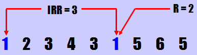

# Cache模拟器优化

## 一、编译与运行

本模拟器开发环境为`Ubuntu 18.04.1 LTS`，使用的编程语言为C++，编译器为`g++`。模拟器源码共包括7个文件：`def.h、storage.h、cache.h、cache.cc、memory.h、memory.cc、main.cc、LIRSContainer.h`，都放在`Cache_Simulator`文件夹中，在该文件夹中还有一个Makefile，如需编译模拟器，在终端输入`make`即可获得可执行程序`cache_simulator`。

该模拟器在命令行上的执行方式是

```c
./cache_simulator -I input_file_path [-LIRS CacheName]* [-PNUM CacheName num]*
Parameters: 
        [-I] 下一个参数为输入文件路径，不可省略，输入文件应为trace文件
        [-LIRS] 下一个参数为cache名称(l1或l2)，指定的cache将以LIRS替换算法代替LRU
        [-PNUM] 下一个参数为cache名称(l1或l2)，下下一个参数为预取模式(默认为0，不预取，
                -1则是streambuffer预取，大于0为直接预取之后num个block)
```

使用`Cache_Simulator`文件夹中的`auto.sh`可以重现所有结果，结果记录在文件夹中的`result.txt`文件中。

## 二、实验结果及分析

### 1.填写参数

- 默认配置下，32nm工艺节点下，L1 Cache的Hit Latency为(1.47944)ns，约等于(3)cycle
- 默认配置下，32nm工艺节点下，L2 Cache的Hit Latency为(1.9206)ns，约等于(4)cycle


### 2.默认配置下，运行trace2017中的两个trace，结果如下：

#### 01-mcf-gem5-xcg

- 运行trace共(10)遍
- L1 Cache： 平均 Miss Rate = (0.200455)
- L2 Cache： 平均 Miss Rate = (0.396293)
- AMAT = (12.948438)

#### 02-stream-gem5-xaa

- 运行trace共(10)遍
- L1 Cache： 平均 Miss Rate = (0.113404)
- L2 Cache： 平均 Miss Rate = (0.755171)
- AMAT = (12.697954)

### 3.最终确定的优化方案

- L1 Cache：LIRS替换算法+stream buffer预取
- L2 Cache：LIRS替换算法+miss block之后2个block预取

#### (1)LIRS替换算法

主要参考[LIRS算法介绍](http://www.thinkingyu.com/articles/LIRS/)。

LIRS使用IRR（Inter-Reference Recency）来表征每个缓存块的历史信息，参照原论文的定义是这样的： 一个缓存块的IRR是指在相继地访问这个块之间访问其它非重复缓存块的个数，用图来说明，如图所示：

<center>

</center>

缓存块1的IRR就是3，因为在相继地访问1之间访问了2,3,4，尽管3被访问两次，但只算一次。特别的，我们把一个块从最近一次访问到当前时间之间访问其它块的非重复个数叫做这个块的recency。比如上图缓存块1的recency是2。

LIRS算法不同于LRU的地方就是在选择要被替换的块时不仅仅考虑recency，也考虑IRR，通过考量一个块的IRR我们就能对这个块的访问历史有更准确的把握。具有较小的IRR的块LIRS称之为LIR块，高IRR块称之为HIR块。所有缓存块被分成LIR和HIR两个集合，LIR块集合的大小需要控制小于Cache的大小以保证LIR块可以常驻Cache，访问LIR块永远不会失效，Cache的一小部分空间留给HIR块，缓存中HIR块会随时被淘汰即使它最近被访问过。HIR块分为两种形式：驻Cache的HIR块（resident-HIR）和非驻Cache的HIR块（nonresident-HIR）。LIRS算法的关键在于如何动态地维护LIR和HIR集合。当一个HIR块再次被访问，它会得到一个新的IRR，如果这个IRR小于LIR集合最大的recency，那么我们需要让此HIR块和具有最大recency的LIR块互换角色以保持LIR和HIR集合的大小恒定。

LIRS数据结构有：

- 栈S：栈S用来存储entries，每个entry都代表一个缓存块并且记录该缓存块的状态（LIR/HIR）和是否驻留在Cache中，LIRS使用这个栈来确定每个缓存块的recency和动态调整LIR和HIR集合。
- 队列Q：为了替换时找寻resident-HIR块方便，把所有resident-HIR块链接到一起形成的链表。

一旦访问不命中需要对Cache中的缓存块进行替换时，选择ListQ的头部的块进行替换，然而这个被替换的HIR块的entry如果在LIRS栈中已存在则仍需要保存它的entry，只不过状态从resident-HIR变为nonresident-HIR。LIRS还有一个特殊的“栈剪枝”操作以确保LIRS栈底的块entry永远处于LIR状态，操作的过程就是从栈底开始将HIR块entry依次删除直到栈底的entry是LIR状态。“栈剪枝”的作用是保持栈底entry状态为LIR，这样如果访问命中一个resident-HIR，那我们就知道这个resident-HIR的新IRR一定小于栈底LIR块的recency，故可以互换它们的角色，并把栈底的resident-HIR块的entry移动到ListQ的链表尾部。

LIRS算法关键流程：

- 访问LIR块：由于LIR块常驻Cache，所以访问肯定命中，只需要把此LIR块entry从当前位置移到LIRS栈顶即可，当然如果LIR块entry原来是在栈底，就需要进行一次栈剪枝。
- 访问resident-HIR块：此时命中，这里分两种情况：（1）如果这个块entry在之前就在LIRS栈里，那么它转化为LIR状态，移到栈顶，并从ListQ中删除它，栈底的LIR块entry转化为HIR状态，移到ListQ队列末尾，开始栈剪枝。（2）由于之前的栈剪枝导致此resident-HIR块的entry不在LIRS栈里，仅在ListQ里，此时把它移到队列末尾，并把一个此entry副本置于LIRS栈栈顶。
- 访问nonresident-HIR块：此时命中失败，决定换出ListQ队头的HIR块，在ListQ里删除它，如果在LIRS栈有它的entry，把它转化为non-resident状态，把待换入的访问块的entry置于LIRS栈顶，这里分两种情况：（1）如果在LIRS栈里有一个待换入块的non-resident状态entry，此时删掉这个entry，把栈顶的entry转化为LIR状态，栈底的LIR entry转化为HIR，移动到ListQ队列尾，进行栈剪枝。（2）如果待换入块没有entry在LIRS栈里，不需要修改它的状态，直接推送一个此块的entry副本到ListQ尾部。

#### (2)stream buffer预取

采用32个stream，每个stream可以存放1个block的数据。32个stream组成一个FIFO的队列，当取得某个地址时，和每个stream中队首block的地址做比较，如果相同，那么视为命中，直接从队首取出这个block并存入cache中，并更新队列的队首，当某个stream中没有元素时，将这个stream的valid置为0。当stream都满了的时候，使用FIFO策略选择一个victim stream。

#### (3)miss block之后n个块预取

L1采用stream buffer预取效果较好，但是L2效果不佳，采用直接预取miss块之后的两个block可以使L2的命中率提高，方式比较简单，即每次miss预取两个之后的块到cache中。

### 4.优化配置下，运行trace2017中的两个trace，结果如下：

#### 01-mcf-gem5-xcg

- 运行trace共(10)遍
- L1 Cache： 平均 Miss Rate = (0.167692)
- L2 Cache： 平均 Miss Rate = (0.346982)
- AMAT = (10.495530)
- 用到的优化策略包括：LIRS替换算法、stream buffer预取、miss block之后2个块预取

#### 02-stream-gem5-xaa

- 运行trace共(10)遍
- L1 Cache： 平均 Miss Rate = (0.022708)
- L2 Cache： 平均 Miss Rate = (0.506142)
- AMAT = (4.376412)
- 用到的优化策略包括：LIRS替换算法、stream buffer预取、miss block之后2个块预取