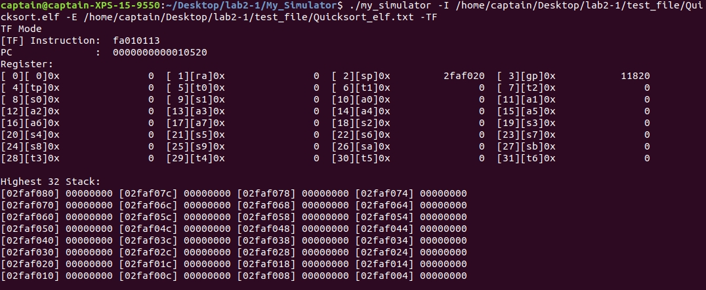
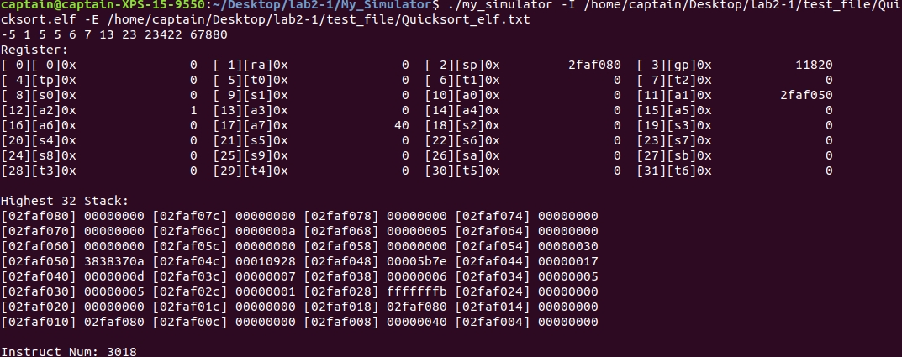
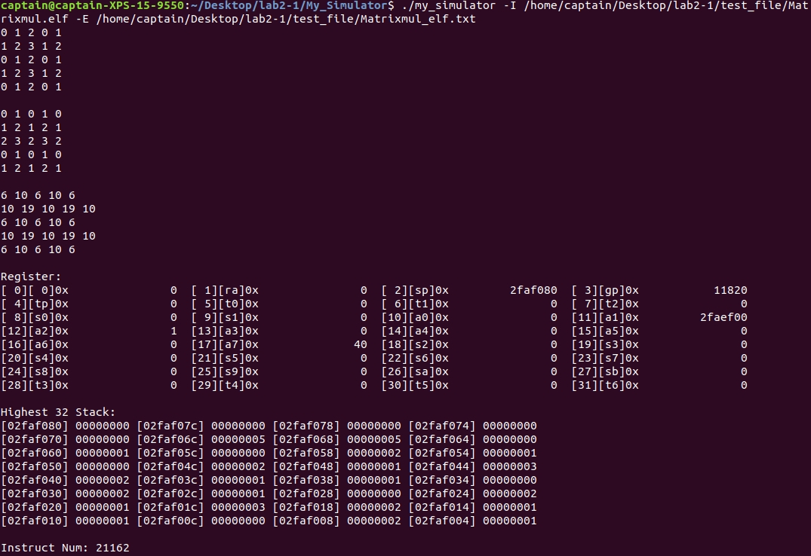
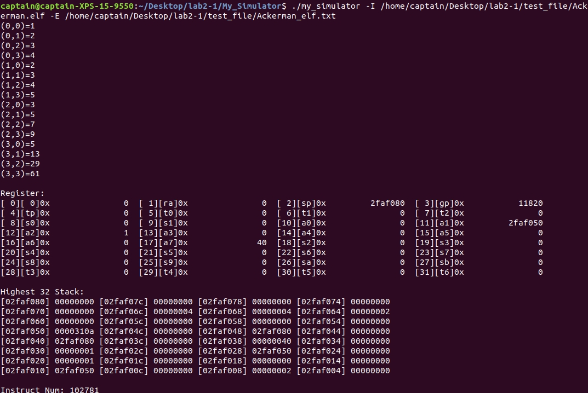

# RISC-V指令级模拟器

## 一、RISC-V工具链的安装与配置

首先，必须下载并安装RISC-V工具链。执行如下步骤：

1. 下载RISC-V gnu compiler toolchain
```c
git clone --recursive https://github.com/riscv/riscv-gnu-toolchain
```
2. 安装需要的库
```c
apt-get install autoconf automake autotools-dev curl libmpc-dev libmpfr-dev libgmp-dev 
gawk buildessential bison flex texinfo gperf libtool patchutils bc zlib1g-dev libexpat-dev
```
3. 进入riscv-gnu-toolchain文件夹，配置后make
```c
cd riscv-gnu-toolchain
./configure --prefix=/opt/riscv
make
```
4. 添加路径到PATH
```c
gedit /etc/profile
#在文件的最后添加
export PATH=$PATH:/opt/riscv/bin
source /etc/profile
```

## 二、设计概述

### 2.1 编译与运行

本模拟器开发环境为`Ubuntu 18.04.1 LTS`，使用的编程语言为C++，编译器为`g++`。模拟器源码共包括4个文件：`Read_Elf.h、Read_Elf.cpp、Simulation.h、Simulation.cpp`，都放在`My_Simulator`文件夹中，在该文件夹中还有一个Makefile，如需编译模拟器，在终端输入`make`即可获得可执行程序`my_simulator`。

该模拟器在命令行上的执行方式是

```c
./my_simulator -I input_file_path [-E output_elf_information_path] [-TF]
Parameters: 
        [-I] 下一个参数为输入文件路径，不可省略，输入文件应为elf文件 
        [-E] 下一个参数为输出文件路径，输出文件为模拟器解析输入文件得到的elf信息，默认输出到stdout
        [-TF] 单步调试
```

### 2.2 测试程序

在`test_file`文件夹中存放了3个测试程序与2个头文件：
```c
Quicksort.c         # 快速排序
Matrixmul.c         # 矩阵乘法
Ackerman.c          # Ackermann函数
Int2Str.h           # 声明以及实现Int2Str函数，用于将整数转换为字符串，以便输出
syscall_riscv.h     # 声明以及实现my_syscall函数，用于创建系统调用
```

可以通过下面的命令将C文件编译为RISC-V下的可执行文件
```c
riscv64-unknown-elf-gcc -Wa,-march=rv64i -o xxx xxx.c
```

文件夹中的其它文件为
```c
*.elf       # 对应c文件编译得到的elf文件
*.s         # 对应elf文件反编译得到的汇编代码
*_elf.txt   # 对应elf文件使用my_simulator模拟运行过程中解析输出的elf信息
```

## 三、代码实现

### 3.1 可执行ELF文件的解析与初始化

该步骤主要在`Read_Elf.h`、`Read_Elf.cpp`中实现，关于ELF文件的介绍可以参考<https://blog.csdn.net/xuehuafeiwu123/article/details/72963229>。

#### 3.1.1 结构体与变量定义

(1)ELF头部
```c++
typedef struct
{
    unsigned char e_ident[16]; /* ELF identification */
    Elf64_Half e_type; /* Object file type */
    Elf64_Half e_machine; /* Machine type */
    Elf64_Word e_version; /* Object file version */
    Elf64_Addr e_entry; /* Entry point address */
    Elf64_Off e_phoff; /* Program header offset */
    Elf64_Off e_shoff; /* Section header offset */
    Elf64_Word e_flags; /* Processor-specific flags */
    Elf64_Half e_ehsize; /* ELF header size */
    Elf64_Half e_phentsize; /* Size of program header entry */
    Elf64_Half e_phnum; /* Number of program header entries */
    Elf64_Half e_shentsize; /* Size of section header entry */
    Elf64_Half e_shnum; /* Number of section header entries */
    Elf64_Half e_shstrndx; /* Section name string table index */
} Elf64_Ehdr;
```

(2)Section头部
```c++
typedef struct
{
	Elf64_Word sh_name; /* Section name */
	Elf64_Word sh_type; /* Section type */
	Elf64_Xword sh_flags; /* Section attributes */
	Elf64_Addr sh_addr; /* Virtual address in memory */
	Elf64_Off sh_offset; /* Offset in file */
	Elf64_Xword sh_size; /* Size of section */
	Elf64_Word sh_link; /* Link to other section */
	Elf64_Word sh_info; /* Miscellaneous information */
	Elf64_Xword sh_addralign; /* Address alignment boundary */
	Elf64_Xword sh_entsize; /* Size of entries, if section has table */
} Elf64_Shdr;
```

(3)Program头部
```c++
typedef struct
{
	Elf64_Word p_type; /* Type of segment */
	Elf64_Word p_flags; /* Segment attributes */
	Elf64_Off p_offset; /* Offset in file */
	Elf64_Addr p_vaddr; /* Virtual address in memory */
	Elf64_Addr p_paddr; /* Reserved */
	Elf64_Xword p_filesz; /* Size of segment in file */
	Elf64_Xword p_memsz; /* Size of segment in memory */
	Elf64_Xword p_align; /* Alignment of segment */
} Elf64_Phdr;
```

(4)符号表条目
```c++
typedef struct
{
	Elf64_Word st_name; /* Symbol name */
	unsigned char st_info; /* Type and Binding attributes */
	unsigned char st_other; /* Reserved */
	Elf64_Half st_shndx; /* Section table index */
	Elf64_Addr st_value; /* Symbol value */
	Elf64_Xword st_size; /* Size of object (e.g., common) */
} Elf64_Sym;
```

(5)变量定义
```c++
extern unsigned long long coff;     //代码段在解释文件中的偏移地址
extern unsigned long long cadr;     //代码段在内存映像的地址
extern unsigned long long csize;    //代码段的长度
extern unsigned long long doff;     //数据段在解释文件中的偏移地址
extern unsigned long long dadr;     //数据段在内存映像的地址
extern unsigned long long dsize;    //数据段的长度
extern unsigned long long sdoff;    //数据段在解释文件中的偏移地址
extern unsigned long long sdadr;    //数据段在内存映像的地址
extern unsigned long long sdsize;   //数据段的长度
extern unsigned long long rdoff;    //数据段在解释文件中的偏移地址
extern unsigned long long rdadr;    //数据段在内存映像的地址
extern unsigned long long rdsize;   //数据段的长度
extern unsigned long long gp;       //全局数据段在内存的地址
extern unsigned long long madr;     //main函数在内存中地址
extern unsigned long long msize;    //main函数长度
extern unsigned long long endPC;    //程序结束时的PC
extern unsigned long long entry;    //程序的入口地址
extern char *filename;              //输入ELF文件路径
extern char *elfname;               //输出ELF信息文件路径
extern FILE *file;
extern FILE *elf;
```

#### 3.1.2 解析ELF文件函数实现

`read_elf`函数共分为四个步骤：

(1)解析ELF头部

`read_Elf_header`函数完成了这部分的工作，比较关键的是需要在这个阶段获得Program头部与Section头部的起始位置以及个数，同时还需要获得Section头部字符串表的索引。具体对于每个字段的处理以及信息输出见代码。
```c++
padr=elf64_hdr.e_phoff;
sadr=elf64_hdr.e_shoff;
psize=elf64_hdr.e_phentsize;
pnum=elf64_hdr.e_phnum;
ssize=elf64_hdr.e_shentsize;
snum=elf64_hdr.e_shnum;
sstridx=elf64_hdr.e_shstrndx;
```

(2)解析Section头部

`read_elf_sections`函数完成了这部分的工作，首先需要找到存放节名称表的节，并将整个节名称表读取。
```c++
//找到放节名称表的节头条目
fseek(file,sadr+sstridx*sizeof(Elf64_Shdr),0);
fread(&elf64_shdr,1,sizeof(elf64_shdr),file);
//找到放节名称表的节
fseek(file,elf64_shdr.sh_offset,0);
unsigned char sectionname[10000];
//读入整个节名称表
fread(sectionname,1,elf64_shdr.sh_size,file);
```

然后回到节头部表的位置，对每个节头部进行解析，在解析的过程中需要注意几个节，并将其部分信息存储，用于之后获得符号表或加载文件到内存。具体对于每个字段的处理以及信息输出见代码。
```c++
fseek(file,sadr,0);

for(int c=0;c<snum;c++)
{
    fprintf(elf," [%3d]\n",c);

    fread(&elf64_shdr,1,sizeof(elf64_shdr),file);
    fprintf(elf," Name: ");
    const char *sec_name=(const char*)(sectionname+elf64_shdr.sh_name);
    fprintf(elf,"%-15s",sec_name);
    if(!strcmp(sec_name,".text")){ //代码段节头
        coff=elf64_shdr.sh_offset;
        cadr=elf64_shdr.sh_addr;
        csize=elf64_shdr.sh_size;
    }
    else if(!strcmp(sec_name,".data")){ //数据段节头
        doff=elf64_shdr.sh_offset;
        dadr=elf64_shdr.sh_addr;
        dsize=elf64_shdr.sh_size;
    }
    else if(!strcmp(sec_name,".sdata")){ //短数据段节头
        sdoff=elf64_shdr.sh_offset;
        sdadr=elf64_shdr.sh_addr;
        sdsize=elf64_shdr.sh_size;
    }
    else if(!strcmp(sec_name,".rodata")){ //只读数据段节头
        rdoff=elf64_shdr.sh_offset;
        rdadr=elf64_shdr.sh_addr;
        rdsize=elf64_shdr.sh_size;
    }
    else if(!strcmp(sec_name,".strtab")){ //字符串表节头
        stradr=elf64_shdr.sh_offset;
        strsize=elf64_shdr.sh_size;
    }
    else if(!strcmp(sec_name,".symtab")){ //符号表节头
        symadr=elf64_shdr.sh_offset;
        symsize=elf64_shdr.sh_size;
    }
    ...
}
```

(3)解析Program头部

`read_Phdr`函数完成了这部分的工作，首先需要找到Program头部表的位置，然后对每个Program头部进行解析，具体对于每个字段的处理以及信息输出见代码。

(4)解析符号表

`read_symtable`函数完成了这部分的工作，首先需要找到字符串表的节，并将整个字符串表读取。
```c++
unsigned char symbolname[10000];
//读.strtab
fseek(file,stradr,0);
fread(symbolname,1,strsize,file);
```

然后回到符号表头部的位置，计算出符号表条目数，然后对每个条目进行解析，在解析的过程中需要注意`main`与`__global_pointer$`，并将其部分信息存储。具体对于每个字段的处理以及信息输出见代码。
```c++
//找到.symtab
fseek(file,symadr,0);
symnum=symsize/sizeof(Elf64_Sym);

for(int c=0;c<symnum;c++)
{
    fprintf(elf," [%3d]   ",c);
    fread(&elf64_sym,1,sizeof(elf64_sym),file);

    const char *sym_name=(const char*)(symbolname+elf64_sym.st_name);
    fprintf(elf," Name:  %40s   ",sym_name);
    if(!strcmp(sym_name,"main")){
        madr=elf64_sym.st_value;
        msize=elf64_sym.st_size;
    }
    else if(!strcmp(sym_name,"__global_pointer$"))
        gp=elf64_sym.st_value;

    ...
}
```

### 3.2 模拟运行

该步骤主要在`Simulation.h`、`Simulation.cpp`中实现。`Simulation.h`中定义了"RISCV-simple-greencard-20181120.pdf"中所有指令以及其他若干指令相关的宏定义，在执行阶段将用于判断指令并作出相应操作。整个模拟的大概流程如下：
```c++
read_elf();     //解析elf文件
load_memory();  //加载内存
PC=entry>>2;    //设置入口地址
reg[3]=gp;      //设置全局数据段地址寄存器
reg[2]=MAX/2;   //栈基址 （sp寄存器）

int endpos=(int)endPC/4-1;  //结束PC的设置
while(PC!=endpos)
{
    jumpflag=false;
    translate_inst();
    execute_inst();
    if(exit_flag==1)
        break;
    if(!jumpflag) PC+=1;
    reg[0]=0;//一直为零
    if(TFflag){ //单步模式
        print_regs();
        print_stack();
        getchar();
    }
}
print_regs();   //打印寄存器信息
print_stack();  //打印栈最高32字信息
printf("Instruct Num: %lld\n",inst_num);
```

单步模式时将逐条指令运行，每运行一条指令，都会停下来打印信息，并且等待任意输入继续执行下一条指令，示意图如下：



#### 3.2.1 加载内存

内存使用memory[MAX]数组进行模拟，寄存器堆使用reg[32]数组模拟，初始时通过`load_memory`函数将程序、数据加载入内存，如下：
```c++
void load_memory()
{
    fseek(file,coff,0);
    fread(&memory[cadr>>2],1,csize,file); //代码段

    fseek(file,doff,0);
    fread(&memory[dadr>>2],1,dsize,file); //数据段

    fseek(file,sdoff,0);
    fread(&memory[sdadr>>2],1,sdsize,file); //短数据段

    fseek(file,rdoff,0);
    fread(&memory[rdadr>>2],1,rdsize,file); //只读数据段

    fclose(file);
}
```

#### 3.2.2 指令译码

`translate_inst`函数完成了这部分的工作，使用在"Simulation.h"中实现的`getbit`函数可以将需要的字段全部整理出来，如下：
```c++
unsigned int getbit(unsigned int instruction,int s,int e) //获取instruction的[s,e]部分
{
    unsigned int mask=0;
    for(int i=s;i<=e;i++)
        mask+=(1<<i);
    instruction=instruction&mask;
    instruction=instruction>>s;
    return instruction;
}

void translate_inst()
{
    inst=memory[PC];
    if(TFflag){
        printf("[TF] Instruction:  %08x\n",inst);
        printf("PC              :  %016llX\n",PC<<2);
    }

    OP=getbit(inst,0,6);        //opcode
    fuc3=getbit(inst,12,14);    //funct3
    fuc7=getbit(inst,25,31);    //funct7
    shamt=getbit(inst,20,25);   
    rs1=getbit(inst,15,19);
    rs2=getbit(inst,20,24);
    rd=getbit(inst,7,11);

    immI=getbit(inst,20,31);    //I-type立即数
    immS=getbit(inst,7,11)+(getbit(inst,25,31)<<5); //S-type立即数
    immSB=(getbit(inst,8,11)<<1)+(getbit(inst,25,30)<<5)+(getbit(inst,7,7)<<11)
         +(getbit(inst,31,31)<<12);   //SB-type立即数
    immU=getbit(inst,12,31)<<12;    //U-type立即数
    immUJ=(getbit(inst,21,30)<<1)+(getbit(inst,20,20)<<11)+(getbit(inst,12,19)<<12)
         +(getbit(inst,31,31)<<20);   //UJ-type立即数

    inst_num+=1;
}
```

#### 3.2.3 执行指令

这是整个模拟阶段最核心的部分，根据Opcode、funct3、funct4对每条指令模拟相应的操作，`execute_inst`函数完成了这部分的工作，该函数实现了"RISCV-simple-greencard-20181120.pdf"中的所有指令附加一些在调试过程中遇到的其他指令，以下节选了Opcode为0x33的指令模拟示例，完整的实现见代码。
```c++
if(OP==OP_R)
{
    if(fuc3==F3_ADD&&fuc7==F7_ADD)
    {
        reg[rd]=(long long)reg[rs1]+(long long)reg[rs2];
    }
    else if(fuc3==F3_MUL&&fuc7==F7_MUL)
    {
        reg[rd]=(long long)reg[rs1]*(long long)reg[rs2];
    }
    else if(fuc3==F3_SUB&&fuc7==F7_SUB)
    {
        reg[rd]=(long long)reg[rs1]-(long long)reg[rs2];
    }
    else if(fuc3==F3_SLL&&fuc7==F7_SLL)
    {
        reg[rd]=(long long)reg[rs1]<<(long long)reg[rs2];
    }
    else if(fuc3==F3_MULH&&fuc7==F7_MULH)
    {
        long long high1,high2,low1,low2;
        high1=((long long)reg[rs1]>>16)>>16;
        high2=((long long)reg[rs2]>>16)>>16;
        low1=(long long)reg[rs1]&0xffffffff;
        low2=(long long)reg[rs2]&0xffffffff;
        reg[rd]=high1*high2+high1*low2+high2*low1;
    }
    else if(fuc3==F3_SLT&&fuc7==F7_SLT)
    {
        reg[rd]=((long long)reg[rs1]<(long long)reg[rs2])?1:0;
    }
    else if(fuc3==F3_XOR&&fuc7==F7_XOR)
    {
        reg[rd]=reg[rs1]^reg[rs2];
    }
    else if(fuc3==F3_DIV&&fuc7==F7_DIV)
    {
        reg[rd]=(long long)reg[rs1]/(long long)reg[rs2];
    }
    else if(fuc3==F3_SRL&&fuc7==F7_SRL)
    {
        reg[rd]=reg[rs1]>>reg[rs2];
    }
    else if(fuc3==F3_SRA&&fuc7==F7_SRA)
    {
        reg[rd]=(long long)reg[rs1]>>(long long)reg[rs2];
    }
    else if(fuc3==F3_OR&&fuc7==F7_OR)
    {
        reg[rd]=reg[rs1]|reg[rs2];
    }
    else if(fuc3==F3_REM&&fuc7==F7_REM)
    {
        reg[rd]=(long long)reg[rs1]%(long long)reg[rs2];
    }
    else if(fuc3==F3_AND&&fuc7==F7_AND)
    {
        reg[rd]=reg[rs1]&reg[rs2];
    }
}
```

### 3.3 系统调用的处理

在一开始的测试时发现，测试程序的printf会进入到printf函数中，而其中包含16位指令，所以为了能够输出测试程序的运行结果，仿照`__internal_syscall`函数自己写了`my_syscall`函数，声明与实现在`test_file/syscall_riscv.h`中，如下：
```c++
static inline long my_syscall(long n,long _a0,long _a1,long _a2,long _a3)
{
    register long a0 asm("a0")=_a0;
    register long a1 asm("a1")=_a1;
    register long a2 asm("a2")=_a2;
    register long a3 asm("a3")=_a3;
    register long a7 asm("a7")=n;

    asm volatile("scall\n"
                :"+r"(a0):"r"(a1),"r"(a2),"r"(a3),"r"(a7));
    return a0;
}
```

测试程序通过my_syscall函数发起系统调用指令，进而打印信息到屏幕，系统调用的`ecall`指令会使用`a0`、`a1`、`a2`、`a3`和`a7`寄存器，`a7`寄存器保存的是系统调用号，`a0`、`a1`、`a2`、`a3`保存了系统调用参数，返回值会保存在`a0`寄存器中。通过这种方式，便可以成功的模拟测试程序的系统调用，在Quicksort.c中的示例如下：
```c++
for(int i=0;i<10;i++){
    len=Int2Str(a[i],buf); //数字转换为字符串存入buf，len为串长
    my_syscall(64,STDOUT_FILENO,(long long)buf,len,0); //输出数字
    buf[0]=' ';
    my_syscall(64,STDOUT_FILENO,(long long)buf,1,0); //输出空格
}
```

`execute_inst`中与系统调用有关的处理如下：
```c++
else if(OP==OP_I5)
{
    if(fuc3==F3_ECALL&&fuc7==F7_ECALL)
    {
        unsigned long long a7=reg[17];
        if(a7==64) //输出
        {
            char *t=(char *)memory+reg[11];
            reg[10]=write((unsigned int)reg[10],t,(unsigned int)reg[12]);
        }
        else if(a7==63) //输入
        {
            char *t=(char *)memory+reg[11];
            reg[10]=read((unsigned int)reg[10],t,(unsigned int)reg[12]);
        }
        else if(a7==169)//time
        {
            reg[10]=time(NULL);
        }
        else if(a7==93) //exit
        {
            exit_flag=1;
        }
    }
}
```

## 四、功能测试

编写的测试程序见下表，注意所有的程序都需要和`Int2Str.h`、`syscall_riscv.h`一起编译。

| 代码文件 | 对应的ELF文件 | 功能描述 |
| :-: | :-: | :-: |
| `testfile/Quicksort.c` | `testfile/Quicksort.elf` | 对10个元素快速排序 |
| `testfile/Matrixmul.c` | `testfile/Matrixmul.elf` | 两个5*5的矩阵乘法 |
| `testfile/Ackerman.c` | `testfile/Ackerman.elf` | 从(0,0)到(3,3)的Ackermann函数值 |

得到的执行结果如下，验证均为正确结果。






