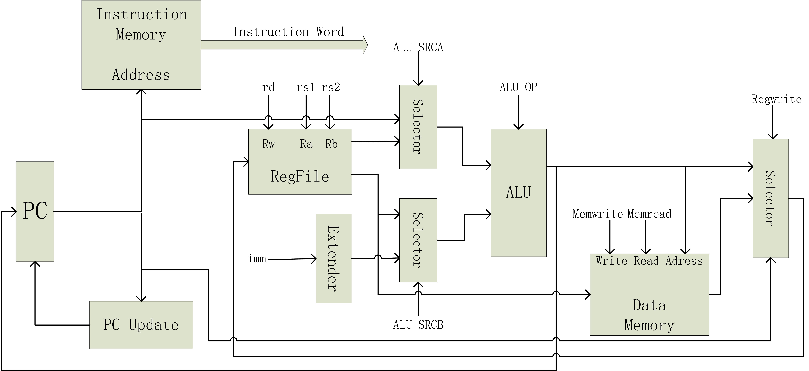
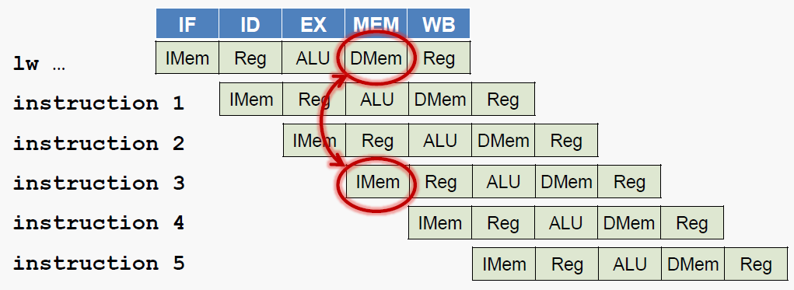
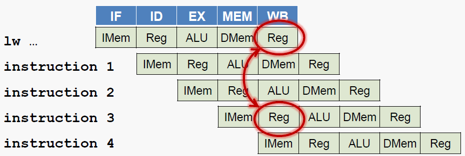
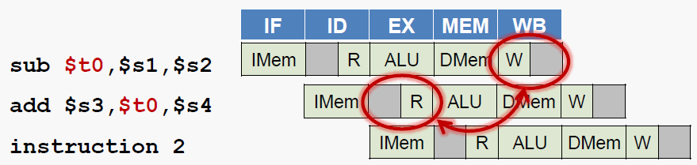
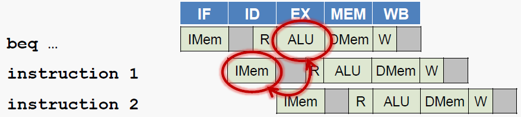

# Lab2-2 RISC-V指令级模拟器

张熙哲 1600012851

大班教师:易江芳

## 一、编译与运行

本模拟器开发环境为`Ubuntu 18.04.1 LTS`，使用的编程语言为C++，编译器为`g++`。模拟器源码共包括5个文件：`Read_Elf.h、Read_Elf.cpp、Simulation.h、Simulation.cpp、Register.h`，都放在`My_Simulator`文件夹中，在该文件夹中还有一个Makefile，如需编译模拟器，在终端输入`make`即可获得可执行程序`my_simulator`。

该模拟器在命令行上的执行方式是

```c
./my_simulator -I input_file_path [-E output_elf_information_path] [-TF] [-S] [-M] [-P]
Parameters: 
        [-I] 下一个参数为输入文件路径，不可省略，输入文件应为elf文件 
        [-E] 下一个参数为输出文件路径，输出文件为模拟器解析输入文件得到的elf信息，默认输出到stdout
        [-TF] 单步调试
        [-S] 单周期处理器模式(默认)
        [-M] 多周期处理器模式
        [-P] 流水线处理器模式
```

## 二、概述

### 2.1 RISC-V多周期处理器

#### 2.1.1 指令各阶段寄存器传输级描述

(1)R类指令(opcode为0x33)

```c
add rd,rs1,rs2
共分为4个阶段
取值：instr[31:0]<-imem[PC],PC<-PC+4
译码：opcode=0x33,func3=0x0,func7=0x00,rs1=instr[19:15],rs2=instr[24:20],rd=inst[11:7]
执行：aluop=0x0000(加法操作),alusrcA=reg[rs1],alusrcB=reg[rs2]
写回：wen=1(aluout),reg[rd]=aluout
```

(2)RW类指令(opcode为0x3B)

```c
addw rd,rs1,rs2
共分为4个阶段
取值：instr[31:0]<-imem[PC],PC<-PC+4
译码：opcode=0x3B,func3=0x0,func7=0x00,rs1=instr[19:15],rs2=instr[24:20],rd=inst[11:7]
执行：aluop=0x0000(加法操作),alusrcA=reg[rs1][31:0],alusrcB=reg[rs2][31:0]
写回：wen=4(aluoutext),reg[rd]=signext[aluout,32]
```

(3)I1类指令(opcode为0x03)

```c
lb rd,offest(rs1)
共分为5个阶段
取值：instr[31:0]<-imem[PC],PC<-PC+4
译码：opcode=0x3B,func3=0x0,rs1=instr[19:15],rd=inst[11:7],immI=inst[31:20]
执行：aluop=0x0000(加法操作),alusrcA=reg[rs1],alusrcB=immI
访存：memread=signext[dmem[aluout],8]
写回：wen=2(memory),reg[rd]=memread
```

(4)I2类指令(opcode为0x13)

```c
addi rd,rs1,imm
共分为4个阶段
取值：instr[31:0]<-imem[PC],PC<-PC+4
译码：opcode=0x13,func3=0x0,rs1=instr[19:15],rd=inst[11:7],immI=inst[31:20]
执行：aluop=0x0000(加法操作),alusrcA=reg[rs1],alusrcB=immI
写回：wen=1(aluout),reg[rd]=aluout
```

(5)I3类指令(opcode为0x1B)

```c
addiw rd,rs1,imm
共分为4个阶段
取值：instr[31:0]<-imem[PC],PC<-PC+4
译码：opcode=0x1B,func3=0x0,rs1=instr[19:15],rd=inst[11:7],immI=inst[31:20]
执行：aluop=0x0000(加法操作),alusrcA=reg[rs1][31:0],alusrcB=immI
写回：wen=4(aluoutext),reg[rd]=signext[aluout,32]
```

(6)I4类指令(opcode为0x67)

```c
jalr rd,rs1,imm
共分为4个阶段
取值：instr[31:0]<-imem[PC],PC<-PC+4
译码：opcode=0x67,func3=0x0,rs1=instr[19:15],rd=inst[11:7],immI=inst[31:20]
执行：aluop=0x0000(加法操作),alusrcA=reg[rs1],alusrcB=immI
写回：wen=3(PC),reg[rd]=PC+4,PC=aluout/4
```

(7)S类指令(opcode为0x23)

```c
sb rs2,offest(rs1)
共分为4个阶段
取值：instr[31:0]<-imem[PC],PC<-PC+4
译码：opcode=0x23,func3=0x0,rs1=instr[19:15],rs2=inst[24:20],immS=inst[11:7]+inst[31,25]<<5
执行：aluop=0x0000(加法操作),alusrcA=reg[rs1],alusrcB=immS
访存：dmem[aluout]=reg[rs2][7:0]
```

(8)SB类指令(opcode为0x63)

```c
beq rs1,rs2,offset
共分为3个阶段
取值：instr[31:0]<-imem[PC],PC<-PC+4
译码：opcode=0x63,func3=0x0,rs1=instr[19:15],rs2=inst[24:20],
     immSB=inst[11:8]<<1+inst[30,25]<<5+inst[7:7]<<11+inst[31:31]<<12
执行：aluop=0x0002(减法操作),alusrcA=reg[rs1],alusrcB=reg[rs2],if(aluout==0) PC+=immSB
```

(9)auipc指令(opcode为0x17)

```c
auipc rd,offset
共分为4个阶段
取值：instr[31:0]<-imem[PC],PC<-PC+4
译码：opcode=0x17,rd=inst[11:7],immU=inst[31:12]<<12
执行：aluop=0x0000(加法操作),alusrcA=PC*4,alusrcB=immU
写回：wen=1(aluout),reg[rd]=aluout
```

(10)lui指令(opcode为0x37)

```c
lui rd,offset
共分为4个阶段
取值：instr[31:0]<-imem[PC],PC<-PC+4
译码：opcode=0x37,rd=inst[11:7],immU=inst[31:12]<<12
执行：aluop=0x0000(加法操作),alusrcA=reg[0],alusrcB=immU
写回：wen=1(aluout),reg[rd]=aluout
```

(11)UJ类指令(opcode为0x6f)

```c
jal rd,imm
共分为4个阶段
取值：instr[31:0]<-imem[PC],PC<-PC+4
译码：opcode=0x6f,rd=inst[11:7],immUJ=inst[31:20]
执行：aluop=0x0000(加法操作),alusrcA=reg[0],alusrcB=immI
写回：wen=3(PC),reg[rd]=PC+4,PC+=aluout
```

#### 2.1.2 数据通路图与控制信号产生逻辑

(1)数据通路图



(2)控制信号产生逻辑

| ALU OP | 功能 | 相关指令 |
| :-: | :- | :- |
| 0 | OUT=A+B | add、addw、addi、addiw、load类指令、store类指令、jalr、auipc、lui、jal |
| 1 | OUT=(A*B)[63:0] | mul、mulw |
| 2 | OUT=A-B | sub、subw、SB类指令 |
| 3 | OUT=A<<B | sll、slli、slliw |
| 4 | OUT=(A*B)[127:64] | mulh |
| 5 | OUT=(A<B)?1:0 | slt、slti |
| 6 | OUT=A^B | xor、xori |
| 7 | OUT=A/B | div、divw |
| 8 | OUT=A>>B(逻辑) | srl、srli、srliw |
| 9 | OUT=A>>B(算术) | sra、srai、sraiw |
| 10 | OUT=A\|B | or、ori |
| 11 | OUT=A%B | rem、remw |
| 12 | OUT=A&B | and、andi |

| ALU SRCA | 源自 | 相关指令 |
| :-: | :- | :- |
| 0 | reg[rs1] | R类指令、load类指令、addi类指令、jalr、store类指令、SB类指令、lui、jal |
| 1 | reg[rs1][31:0] | RW类指令、addiw类指令 |
| 2 | PC | auipc |

| ALU SRCB | 源自 | 相关指令 |
| :-: | :- | :- |
| 0 | reg[rs2] | R类指令、SB类指令 |
| 1 | reg[rs2][31:0] | RW类指令 |
| 2 | 扩展imm | I类指令、S类指令、auipc、lui、jal |

| BRANCH | 功能 | 相关指令 |
| :-: | :- | :- |
| 1 | 返回jump标记 | jal |
| 2 | if(reg[rs1]==reg[rs2]) 返回jump标记 | beq |
| 3 | if(reg[rs1]!=reg[rs2]) 返回jump标记 | bne |
| 4 | if(reg[rs1]<reg[rs2]) 返回jump标记 | blt |
| 5 | if(reg[rs1]>=reg[rs2]) 返回jump标记 | bge |
| 6 | PC=ALUOUT，返回jump标记 | jalr |
| 0 | 无跳转 | 其余指令 |

| MEMREAD | 功能 | 相关指令 |
| :-: | :- | :- |
| 1 | memread=signext(dmem(ALUOUT,byte),8) | lb |
| 2 | memread=signext(dmem(ALUOUT,half),16) | lh |
| 3 | memread=signext(dmem(ALUOUT,word),32) | lw |
| 4 | memread=dmem(ALUOUT,doubleword) | ld |
| 5 | memread=dmem(ALUOUT,byte) | lbu |
| 0 | 无读内存 | 其余指令 |

| MEMWRITE | 功能 | 相关指令 |
| :-: | :- | :- |
| 1 | dmem(ALUOUT)=reg[rs2][7:0] | sb |
| 2 | dmem(ALUOUT)=reg[rs2][15:0] | sh |
| 3 | dmem(ALUOUT)=reg[rs2][31:0] | sw |
| 4 | dmem(ALUOUT)=reg[rs2][63:0] | sd |
| 0 | 无写内存 | 其余指令 |

| REGWRITE | 功能 | 相关指令 |
| :-: | :- | :- |
| 0 | 无写寄存器 | S类指令、SB类指令 |
| 1 | reg[rd]=ALUOUT | R类指令、addi类指令、auipc、lui |
| 2 | reg[rd]=memread | load类指令 |
| 3 | reg[rd]=PC+4 | jal、jalr |
| 4 | reg[rd]=signext(ALUOUT,32) | RW类指令、addiw类指令 |

#### 2.1.3&4 测试程序动态指令数&执行周期数及平均CPI

原始运行结果存放于`result_multi.txt`，以下为汇总：

| 测试程序 | 动态指令数 | 执行周期数 | 平均CPI |
| :-: | :-: | :-: | :-: |
| test1 | 28 | 119 | 4.250000 |
| test2 | 28 | 119 | 4.250000 |
| test3 | 117 | 496 | 4.239316 |
| test4 | 162 | 691 | 4.265432 |
| test5 | 118 | 690 | 5.847458 |
| test6 | 68 | 480 | 7.058824 |
| test7 | 132 | 561 | 4.250000 |
| test8 | 60 | 248 | 4.133333 |
| test9 | 33 | 180 | 5.454545 |
| test10 | 23 | 138 | 6.000000 |

### 2.2 RISC-V流水线处理器

#### 2.2.1 流水线阶段划分

流水线共分为5个阶段：

| 阶段 | 描述 |
| :-: | :- |
| 取指 | 指令译码，从寄存器堆读出寄存器的值 |
| 译码 | 从存储器取指令，更新PC |
| 执行 | 运算指令:进行算术逻辑运算<br>访存指令:计算存储器的地址 |
| 访存 | load指令:从存储器读数据<br>store指令:将数据写入存储器 |
| 写回 | 将数据写入寄存器堆 |

#### 2.2.2 数据通路图与控制信号产生逻辑

(1)数据通路图


(2)控制信号产生逻辑

| ALU OP | 功能 | 相关指令 |
| :-: | :- | :- |
| 0 | OUT=A+B | add、addw、addi、addiw、load类指令、store类指令、jalr、auipc、lui、jal |
| 1 | OUT=(A*B)[63:0] | mul、mulw |
| 2 | OUT=A-B | sub、subw、SB类指令 |
| 3 | OUT=A<<B | sll、slli、slliw |
| 4 | OUT=(A*B)[127:64] | mulh |
| 5 | OUT=(A<B)?1:0 | slt、slti |
| 6 | OUT=A^B | xor、xori |
| 7 | OUT=A/B | div、divw |
| 8 | OUT=A>>B(逻辑) | srl、srli、srliw |
| 9 | OUT=A>>B(算术) | sra、srai、sraiw |
| 10 | OUT=A\|B | or、ori |
| 11 | OUT=A%B | rem、remw |
| 12 | OUT=A&B | and、andi |

| ALU SRCA | 源自 | 相关指令 |
| :-: | :- | :- |
| 0 | reg[rs1] | R类指令、load类指令、addi类指令、jalr、store类指令、SB类指令、lui、jal |
| 1 | reg[rs1][31:0] | RW类指令、addiw类指令 |
| 2 | PC | auipc |

| ALU SRCB | 源自 | 相关指令 |
| :-: | :- | :- |
| 0 | reg[rs2] | R类指令、SB类指令 |
| 1 | reg[rs2][31:0] | RW类指令 |
| 2 | 扩展imm | I类指令、S类指令、auipc、lui、jal |

| BRANCH | 功能 | 相关指令 |
| :-: | :- | :- |
| 1 | 返回jump标记 | jal |
| 2 | if(reg[rs1]==reg[rs2]) 返回jump标记 | beq |
| 3 | if(reg[rs1]!=reg[rs2]) 返回jump标记 | bne |
| 4 | if(reg[rs1]<reg[rs2]) 返回jump标记 | blt |
| 5 | if(reg[rs1]>=reg[rs2]) 返回jump标记 | bge |
| 6 | PC=ALUOUT，返回jump标记 | jalr |
| 0 | 无跳转 | 其余指令 |

| MEMREAD | 功能 | 相关指令 |
| :-: | :- | :- |
| 1 | memread=signext(dmem(ALUOUT,byte),8) | lb |
| 2 | memread=signext(dmem(ALUOUT,half),16) | lh |
| 3 | memread=signext(dmem(ALUOUT,word),32) | lw |
| 4 | memread=dmem(ALUOUT,doubleword) | ld |
| 5 | memread=dmem(ALUOUT,byte) | lbu |
| 0 | 无读内存 | 其余指令 |

| MEMWRITE | 功能 | 相关指令 |
| :-: | :- | :- |
| 1 | dmem(ALUOUT)=reg[rs2][7:0] | sb |
| 2 | dmem(ALUOUT)=reg[rs2][15:0] | sh |
| 3 | dmem(ALUOUT)=reg[rs2][31:0] | sw |
| 4 | dmem(ALUOUT)=reg[rs2][63:0] | sd |
| 0 | 无写内存 | 其余指令 |

| REGWRITE | 功能 | 相关指令 |
| :-: | :- | :- |
| 0 | 无写寄存器 | S类指令、SB类指令 |
| 1 | reg[rd]=ALUOUT | R类指令、addi类指令、auipc、lui |
| 2 | reg[rd]=memread | load类指令 |
| 3 | reg[rd]=PC+4 | jal、jalr |
| 4 | reg[rd]=signext(ALUOUT,32) | RW类指令、addiw类指令 |

#### 2.2.3 流水线中的冒险

<b>(1)结构冒险</b>

所需的硬件部件正在为之前的指令工作

例1:如果指令和数据放在同一个存储器中，则不能同时读存储器



例2:读寄存器和写寄存器同时发生



<b>(2)数据冒险</b>

需要等待之前的指令完成数据的读写

例:一条指令需要使用之前指令的运算结果，但是结果还没有写回



<b>(3)控制冒险</b>

需要根据之前指令的结果决定下一步的行为

例:尚未确定是否发生分支，如何取指



#### 2.2.4&5 测试程序动态指令数及执行周期数及平均CPI&冒险停顿次数

原始运行结果存放于`result_pipeline.txt`，以下为汇总：

| 测试程序 | 动态指令数 | 执行周期数 | 平均CPI | 控制冒险 | 数据冒险 |
| :-: | :-: | :-: | :-: | :-: | :-: |
| test1 | 28 | 88 | 3.142857 | 0 | 28 |
| test2 | 28 | 88 | 3.142857 | 0 | 28 |
| test3 | 117 | 354 | 3.025641 | 6 | 108 |
| test4 | 162 | 499 | 3.080247 | 6 | 158 |
| test5 | 118 | 549 | 4.652542 | 6 | 110 |
| test6 | 68 | 399 | 5.867647 | 6 | 60 |
| test7 | 132 | 409 | 3.098485 | 6 | 128 |
| test8 | 60 | 224 | 3.733333 | 0 | 80 |
| test9 | 33 | 127 | 3.848485 | 2 | 23 |
| test10 | 23 | 107 | 4.652174 | 0 | 20 |